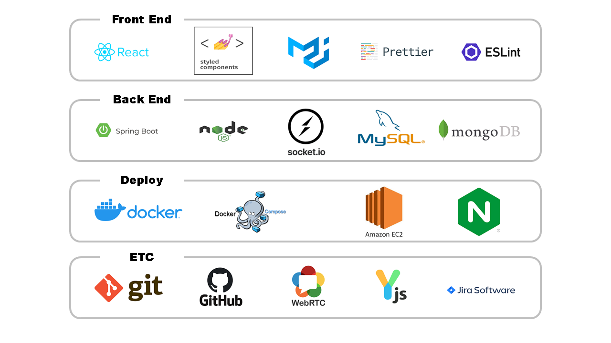
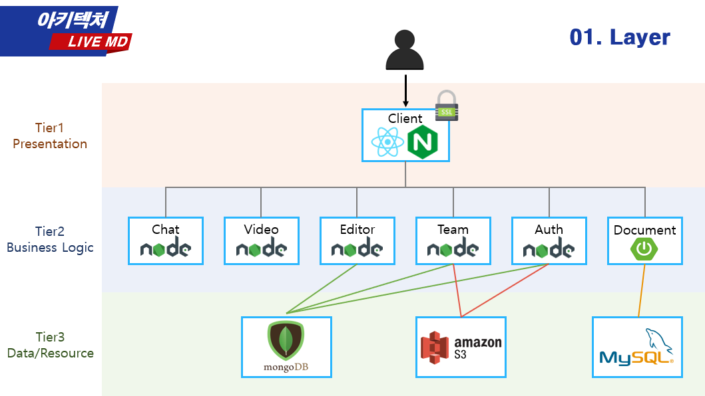
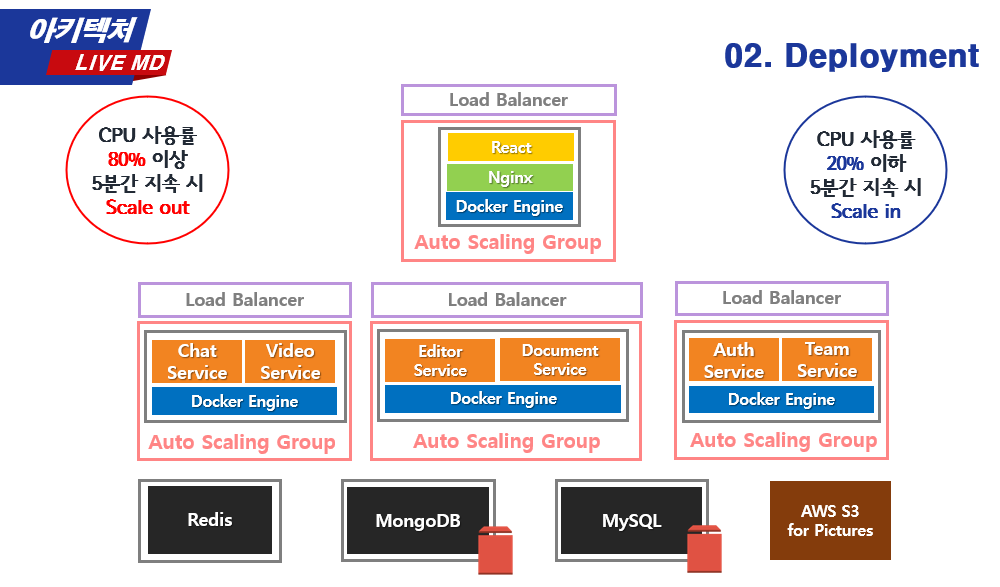

<p align='middle'>
<a href='https://live-md.com'></a></p>
<p align='middle'><a href="https://github.com/bbzzkk/LiveMD/wiki?style=flat-square"/></a>   

<h1 align='middle'><a href='https://live-md.com'>https://live-md.com</a></h1>

📚[위키](https://github.com/bbzzkk/LiveMD/wiki)에선 더 다양한 정보와 개발 과정을,  
LiveMD의 다양한 모습을 살펴보세요!

---

## 목차

1. [프로젝트 소개](#프로젝트-소개)  
   1-1. [프로젝트 목표](#📌프로젝트-목표)  
   1-2. [프로젝트 소개 및 시연 영상](#📽-프로젝트-소개-및-시연-영상)  
   1-3. [기술 스택](#⚙-기술-스택)  
   1-4. [아키텍처 및 배포 구조](#🔃-아키텍처-및-배포-구조)
2. [실행 방법](#👨‍💻실행-방법)
3. [개발 유의사항](#❕-개발-유의사항-❗)
4. [팀원 소개](#👨‍👨‍👧팀원-소개)

---

## 프로젝트 소개

### 📌프로젝트 목표

LiveMD는 온라인 회의를 하는 사람들을 위한 **실시간 소통 협업 에디터**입니다.  
LiveMD는 온라인 회의에 필요한 **실시간 의사소통 기능**, **에디터 기능**, **문서 공동 편집 기능**을 합쳐 하나의 서비스로 제공하는 것을 목표로 합니다.

### 📽 프로젝트 소개 및 시연 영상

> 사진을 클릭하면 유튜브 페이지로 이동합니다

<p align='middle'><a href="https://www.youtube.com/watch?v=nR2TqMuPBzE&t=2s" target="_blank"></a></p>

### ⚙ 기술 스택

<p align='middle'><a href='./images/skill-stack.png'></a></p>

### 🔃 아키텍처 및 배포 구조

<p align='middle'><a href='./images/3-tier.png'></a></p>
<p align='middle'><a href='./images/deployment1.png'></a>
<a href='./images/deployment2.png'></a></p>

---

## 👨‍💻실행 방법

1. Node.js 개발 환경

- client
- express-auth
- express-team
- express-chat
- express-vide
- express-yjs
  
> ※ 실행 전 `.env` or `configuration`를 설정하고 서버를 시작해야 정상적으로 동작합니다.

### 설치

```shell
yarn install
```

### 실행

```shell
yarn start
```

2. Spring boot 개발 환경

- spring-document

```shell
./gradlew build --exclude-task test
java -jar build/libs/document-1.0-SNAPSHOT.jar
```

---

## ❕ 개발 유의사항 ❗

git clone 이후, git hooks 적용을 위해 반드시 아래 명령어를 실행해야 합니다.

```bash
git clone https://github.com/bbzzkk/LiveMD.git
# 또는 
git clone https://github.com/bbzzkk/LiveMD.git

./setup_hooks.sh
```

github wiki에 게시한 [commit style](https://github.com/bbzzkk/livemd/wiki/04.-Git-Commit-Message-Style-Guide) , [branch style](https://github.com/bbzzkk/livemd/wiki/05.-Git-Branch-Style-Guide)을 준수합니다.

---

## 👨‍👨‍👧팀원 소개

<table>
  <tr>
  <td align="center">
  <sub>
    자칭 우아한
  </sub>
  </td>
  <td align="center">
  <sub>
    행복한
  </sub>
  </td>
  <td align="center">
  <sub>
    근엄한
  </sub>
  </td>
  <td align="center">
  <sub>
    깜찍한
  </sub>
  </td>
  <td align="center">
  <sub>
    활력소
  </sub>
  </td>
  </tr>
  <tr>
    <td align="center"><a href="https://github.com/kwak-bs"><br /><sub><b>곽병선</b></sub></a><br /></td>
    <td align="center"><a href="https://github.com/Joylish"><br /><sub><b>이연주</b></sub></a><br /></td>
    <td align="center"><a href="https://github.com/JSWww"><br /><sub><b>조성원</b></sub></a><br /></td>
    <td align="center"><a href="https://github.com/soyoung-Jung"><br /><sub><b>정소영</b></sub></a><br /></td>
    <td align="center"><a href="https://github.com/hataerin"><br /><sub><b>하태린</b></sub></a><br /></td>
  </tr>
</table>

### 🧐 LiveMD 개발자의 컨디션

저희는 데일리 스크럼마다, 그날의 컨디션을 기록하고 서로 확인했어요!  
LiveMD 개발자들의 가장 높았던 컨디션 점수는 몇 점이었을까요?

[데일리 스크럼 보러가기](https://github.com/bbzzkk/LiveMD/wiki#daily-scrum--wrap-up)

[스프린트 보러가기](https://github.com/bbzzkk/LiveMD/wiki/16.-Sprint-log)

---

## 응원하기

이 프로젝트가 마음에 드셨다면 ⭐️을 눌러주세요!
